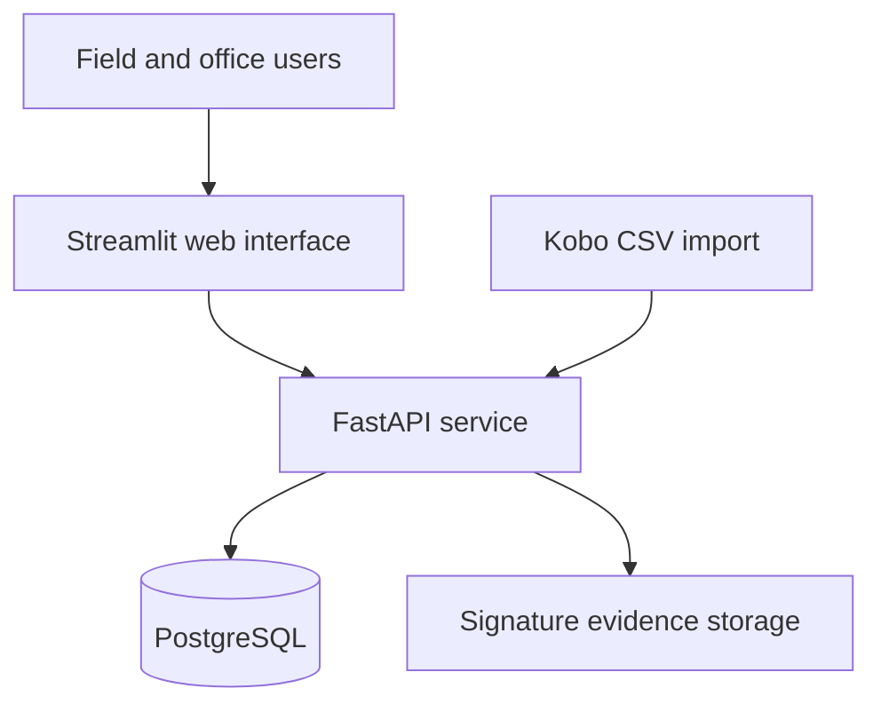
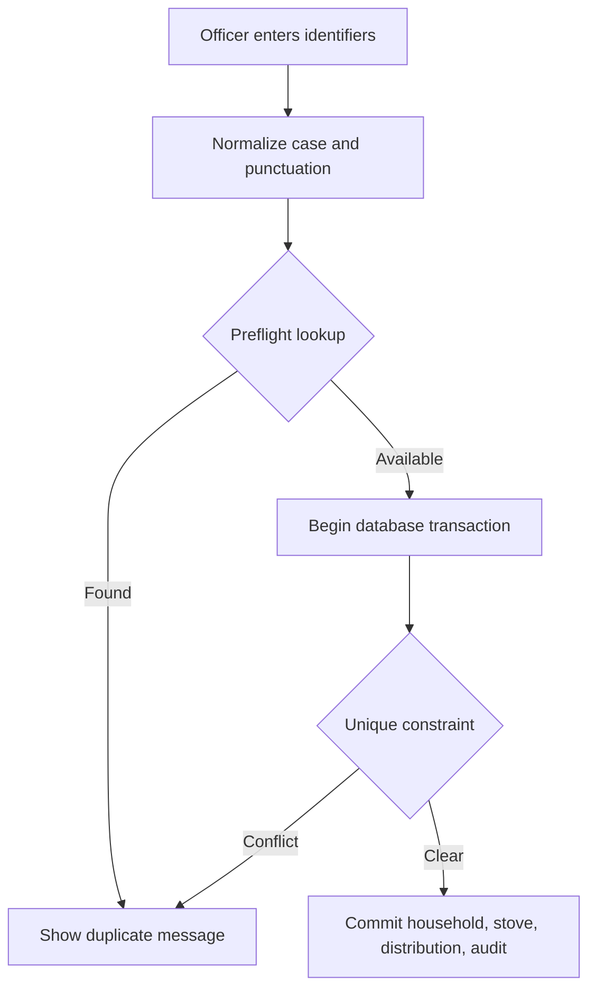
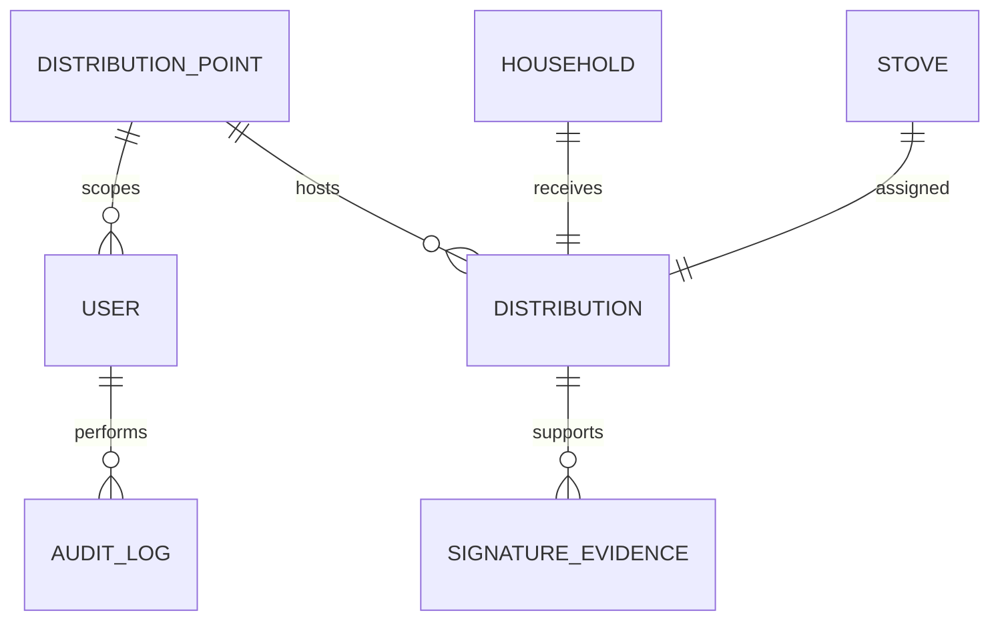
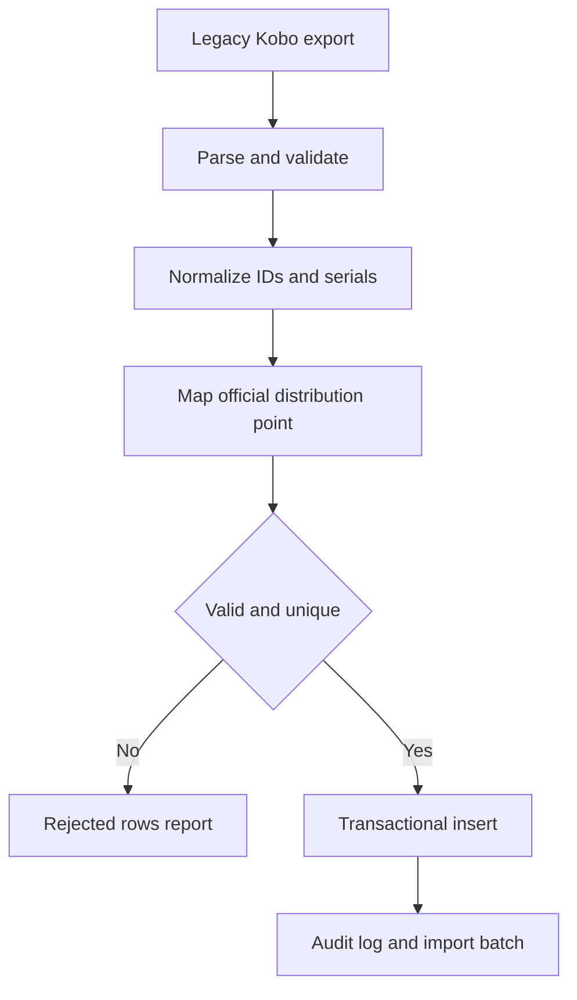

# UGA Stove Architecture

## System shape

The browser interacts with Streamlit. Streamlit calls FastAPI using a short lived authenticated token. All permission checks and business rules run in FastAPI. PostgreSQL is the source of truth. Signature images or scans are kept outside the database, while the database stores protected metadata and a SHA 256 digest.

## Why this is not one large Streamlit script

A single script with a local CSV or SQLite file would be quick to demonstrate and poor to operate. It would permit concurrency races, make permission enforcement easy to bypass, mix interface code with data rules, and risk losing state when the host restarts. The service boundary allows the same API to support a future mobile or Progressive Web App without rewriting the database rules.

## Duplicate prevention

The preflight check improves usability. The database unique constraints provide correctness. Both are necessary because two users can pass a preflight check and still submit at the same time.

`B-00120`, `b 00120`, and `B_00120` normalize to the same household key. `PS_UG_M1996` and `ps-ug-m1996` normalize to the same stove serial key. The display value is retained, while the normalized value is used for uniqueness.

## Principal entities

One household and one stove participate in only one distribution. Corrections update the record under optimistic concurrency control and preserve before and after values in the audit log.

## Signature evidence workflow

i. The system generates a two page PDF with a unique verification code and QR code.

ii. The beneficiary signs the printed page using ink or a thumbprint according to the project's approved field procedure.

iii. The officer uses the phone camera through the Streamlit page or uploads a scan.

iv. FastAPI verifies the file type and size, strips image metadata by re encoding images, calculates SHA 256, stores the evidence, and records beneficiary, witness, timestamp, optional coordinates, and capturing user.

v. A data manager reviews the evidence and marks it verified or rejected. Every action is audited.

This is a practical way to prove that a paper signature was captured. It is not a cryptographic electronic signature and should not be described as one.

## Role model

| Role | Aggregate dashboard | Household details | Add record | Correct ordinary fields | Change identifiers | Capture signature | Verify signature | Import | Audit | Manage users |
| --- | --- | --- | --- | --- | --- | --- | --- | --- | --- | --- |
| Administrator | Yes | Yes | Yes | Yes | Yes | Yes | Yes | Yes | Yes | Yes |
| Data manager | Yes | Yes | Yes | Yes | Yes | Yes | Yes | Yes | Yes | No |
| Distribution officer | Yes | Assigned point | Assigned point | Assigned point | No | Assigned point | No | No | No | No |
| Auditor | Yes | Read only | No | No | No | No | No | No | Yes | No |
| Stakeholder | Yes | No | No | No | No | No | No | No | No | No |

## Import pipeline

Rows with any identifier duplicated inside the same source file are all quarantined. The importer does not arbitrarily accept the first row. Rows that conflict with existing database identifiers are also quarantined. An exact source file hash prevents the same completed import from being run twice.

## Reliability and scale

The expected volume is small for PostgreSQL. The design is nevertheless safe for much larger volumes because searches use indexed normalized identifiers, dashboard work is aggregated in SQL, files sit outside the relational database, API workers are stateless, and the user interface can be replicated behind a load balancer.

Health checks and dependency readiness prevent the web service from starting before PostgreSQL and the API are ready. Containers use automatic restart policies. Database connections use pre ping checks and recycling. These controls reduce common failures but do not make outages mathematically impossible.

At larger scale, move PostgreSQL to a managed service, use S3 compatible evidence storage, add Redis based login rate limiting, run multiple API and Streamlit replicas, cache only aggregate dashboard queries, and add centralized logs and metrics.

